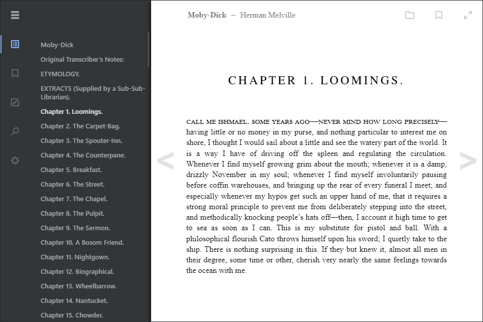

Epub.js Reader
================================



About the Reader
-------------------------

[Epub.js](https://github.com/futurepress/epub.js) library.


Getting Started
-------------------------

Open up [epubjs-reader](https://intity.github.io/epubjs-reader/) in a browser.

You can change the ePub it opens by passing a link to bookPath in the url:

`?bookPath=https://s3.amazonaws.com/epubjs/books/alice.epub`

Running Locally
-------------------------

Install [node.js](https://nodejs.org/en/)

Then install the project dependences with npm

```javascript
npm install
```

You can run the reader locally with the command

```javascript
npm run serve
```

Builds are concatenated and minified using [webpack](https://github.com/webpack/webpack)

To generate a new build run

```javascript
npm run build
```
