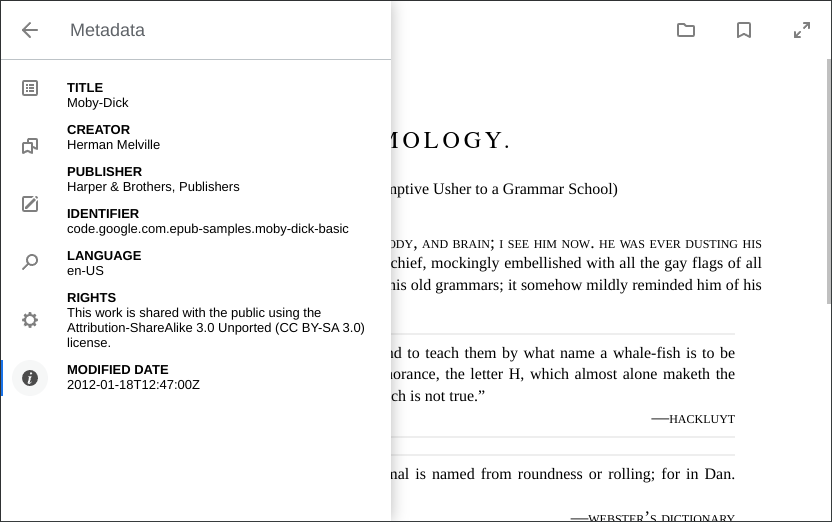

About this fork
================================

This fork is *only* used to re-package and integrate epubjs-reader with COPS

Please see https://github.com/intity/epubreader-js for the original fork - with thanks to @intity and the alpha/beta testers :-)

This fork is meant for a web-based epub reader, where the initial `bookPath` is set via template variable in [dist/template.html](dist/template.html), e.g. with PHP Twig or Python Jinja2, and the epub content is served from the original .epub file via a PHP or Python script like [src/zipfs.php](src/zipfs.php), e.g. with bookPath = http://localhost:8000/zipfs.php/{bookId}/

The [dist/ files](dist/) are available as:
* PHP composer package: [mikespub/epubjs-reader](https://packagist.org/packages/mikespub/epubjs-reader), or
* NPM javascript package: [@mikespub/epubjs-reader](https://www.npmjs.com/package/@mikespub/epubjs-reader).

Epub.js Reader
================================



## About the Reader

The **epubreader-js** application is based on the [epub.js](https://github.com/futurepress/epub.js) library and is a fork of the [epubjs-reader](https://github.com/futurepress/epubjs-reader) repository.

## Getting Started

Open up [epubreader-js](https://intity.github.io/epubreader-js/) in a browser.

You can change the ePub it opens by passing a link to `bookPath` in the url:

`?bookPath=https://s3.amazonaws.com/epubjs/books/alice.epub`

## Running Locally

Install [node.js](https://nodejs.org/en/)

Then install the project dependences with npm

```javascript
npm install
```

You can run the reader locally with the command

```javascript
npm run serve
```

Builds are concatenated and minified using [webpack](https://github.com/webpack/webpack)

To generate a new build run

```javascript
npm run build
```

or rebuilding all *.js files

```javascript
npm run prepare
```

## Pre-configuration

The **epubreader-js** application settings is a JavaScript object that you pass as an argument to the `Reader` constructor. You can make preliminary settings in the file [index.html](dist/index.html). For example, this is what the default `Reader` initialization looks like:

```html
<script type="module">
    import { Reader } from "./js/epubreader.min.js"
    const url = new URL(window.location)
    const path = url.searchParams.get("bookPath") || "https://s3.amazonaws.com/moby-dick/"
    window.onload = (e) => new Reader(path)
</script>
```

Let's say we want to disable the `openbook` feature, which is designed to open an epub file on a personal computer. This can be useful for integrating a public library into your site. Let's do this:

```html
<script type="module">
    import { Reader } from "./js/epubreader.min.js"
    const url = "{{bookPath}}"
    window.onload = (e) => new Reader(url, { openbook: false })
</script>
```

> Note that the `{{bookPath}}` replacement token is used to define the `url` string variable. This simple solution will allow you to set up a route to pass the target URL.

## Features

The **epubreader-js** application supports the following features:

- Initial support for mobile devices
- Saving settings in the browser’s local storage
- Opening a book file from the device’s file system
- Bookmarks
- Annotations
- Search by sections of the book
- Output epub metadata
- [Keybindings](docs/keybindings.md)
