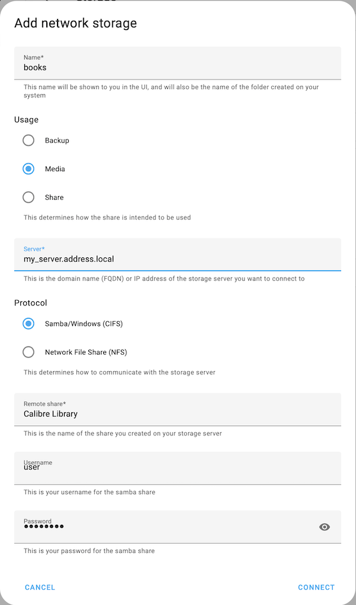

#  HA COPS


COPS is a lightweight system for providing access to your Calibre Library via a web browser. It is built in PHP. It uses less resources than the full Calibre Web Server - ideal for running on a small server such as Home Assistant. That is what this Add-on enables.

The motivation for this was realising that I could easily make my music and video collection available to my family and friends when visiting my home, but my ePub collection was not available. I have happy childhood memories of discovering books in my parents book collection, but since I mainly buy eBooks now that experience isn't so easy for my kids.

This Add-on runs COPS using PHP's built in webserver, as well as providing rsync to get books onto your Home Assistant server - a books folder will be created in the `/media` directory of your home assistant server.

## Installation

1. Install this repository

[](https://my.home-assistant.io/redirect/supervisor_add_addon_repository/?repository_url=https%3A%2F%2Fgithub.com%2Fdunxd%2FHomeAssistantAddons)

2. Install the add-on

[](https://my.home-assistant.io/redirect/supervisor_addon/?addon=670b30ea_ha-cops&repository_url=https%3A%2F%2Fgithub.com%2Fdunxd%2FHomeAssistantAddons)

## Configuration

Defaults should work, but you can change the display title of your library. If you have other add-ons that provide a web interface, you may want to change the ports used for http (8000/tcp) and rsync(873/tcp) to avoid conflicts.

## Getting your library onto your HA server

There are two methods for making your Calibre Library available to this addon:

- Copy Calibre library files to a local directory on the Home Assistant server
- Use a Network Share (requires Home Assistant >= 2023.6)

### Copy your Calibre library onto the Home Assistant server.

This is useful if you don't want to run another computer 24/7 or if storage space on your Home Assistant server is limited. Rsync is included to allow copying your Calibre library onto the HA server for use in this add-on. Rsync is configured to only allow syncing to the `/media/books` directory that is created by the add-on. You will need rsync installed on the computer where you run Calibre. You can then use a command similar to this to copy all the required files across:

```
rsync -av --exclude '*.original_*' ~/Calibre\ Library/* rsync://{server_address}:8873/books
```

You may need to change `~/Calibre\ Library` to where your Calibre library is stored - the above example works for a Mac running a standard install of Calibre.

You can use this command to sync any changes made in Calibre - new books added, changes to metadata etc. You can exclude files from being transferred using [the `--exclude` option for rsync](https://www.man7.org/linux/man-pages/man1/rsync.1.html#FILTER_RULES). In the example above I have excluded file types starting `.original_*` type files, as mostly these are duplicates of files converted in Calibre, and original_epub and original_azw are ignored by COPS anyway. Suggestions for improving this are welcome.

### Use a Network Share

As of Home Assistant 2023.6 it is possible to mount a network share onto your Home Assistant share. This is particularly useful if your Calibre Library is stored on Network Attached Storage.

To use a Network Share you need to set it up in Home Assistant:

[](https://my.home-assistant.io/redirect/storage/)

Click on the Add Network Storage button and create a mount named `books` with Usage type of Media. This will mount the library to `/media/books` which is where the addon expects to find the necessary files.

[.

Note that you do not need to escape spaces if the share name has them in it.

If you are using this method, you can disable the rsync server in the add-on configuration.

## Accessing your library

You can access your library in your browser at http://_ha-ip-address-or-name_:8000. You can change the port if necessary. Ingress does not currently work.

You can also access an OPDS feed of your library in apps like [Librera reader (Android)](https://play.google.com/store/apps/details?id=com.foobnix.pdf.reader) allowing you to easily download books into the reader. The feed is available at http://_ha-ip-address-or-name_:8000/feed.php

## User side configuration

It is possible for the user to adjust some settings in the web interface. Currently this is only available in the Default template - click on the link at the top right to change to that template, then click on the spanner icon. Most of these aren't particularly interesting. Note that emailing books (e.g. to a Kindle email address) does not currently work so the option to add an email address does nothing.

## Accessing the library from a Kindle

The library can be accessed using the Web Browser in an Amazon Kindle, and MOBI and AZW format files can be downloaded. Unfortunately the Kindle web browser does not work well with the nicer Bootstrap2 template, and it is also not easy to switch back to Default. As a result, I have made the Default template the initial template. If you find yourself stuck in the Bootstrap2 template, clear your cookies and you should get the Default template again.

## Security

This Add-on is intended to be run in a home network, _not_ on the public internet. The PHP built in web server is not designed for scale and does not have security features. rsync is also not intended to be made available over the public internet. Sharing your books publically is also not advised. Pages are served over an unencrypted http connection.

I use the Cloudflared Add-on to make my library available outside my home - this allows simple passcode logins using Cloudflare Zero Trust.

# Config

- Currently you are able to change the display name of your library.

# Known issues

- Reading books in the browser only works for EPubs that have a NCX table of contents file. This is required for EPub v2, but not for EPub v3 books. Some EPub v3 books may include the NCX file in which case they work. Calibre does not create a NCX when converting to EPub v3, but does for EPub v2. A NCX file can be created for EPub v3 in Calibre by invoking the ToC Editor - this creates a NCX file which is saved when clicking Ok.
- COPS has a built in system for emailing books - e.g. as Docs to your Kindle device. This does not yet work in the add-on as it was written for an older version of PHP, but may be added later.

# Acknowledgements

This is based on [COPS](https://github.com/seblucas/cops) written by Sebastian Lucas, but [updated to use PHP8 by Matt's Pub](https://github.com/mikespub-org/seblucas-cops).
